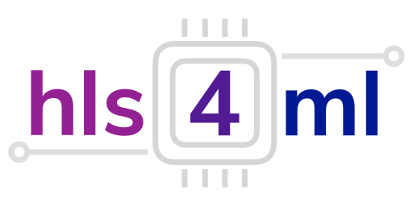

<p align="center">
  
</p>

# FDF hls4ml Tutorial

> **Setup instructions**
>
> ```bash
> git clone https://github.com/gflengas/FDF-HLS4ML-TUTORIAL.git
> cd FDF-HLS4ML-TUTORIAL
> conda env create -f environment.yml
> python -m ipykernel install --user --name fdf-minimal --display-name "Python (fdf-minimal)"
> ```
>
> Reload the page and open `part1_mlp.ipynb`. In the top-right corner, click the Python kernel selector and choose `Python (fdf-minimal)`.

## Companion Material

We have prepared a set of slides with some introduction and more details on each of the exercises.
Please find them [here](). 

## Notebooks

- `part1_mlp.ipynb`: introduces the basic hls4ml workflow with a small multilayer perceptron model, from loading the model and data through conversion, simulation, and report inspection.
- `part2_cnn.ipynb`: extends the flow to CNNs on MNIST, including baseline, pruned, and quantized models, plus synthesis report comparisons.
- `part3_bitstream&deployment.ipynb`: shows the Vitis Unified deployment flow, including bitstream-oriented project generation and preparing the test artifacts needed for deployment.
